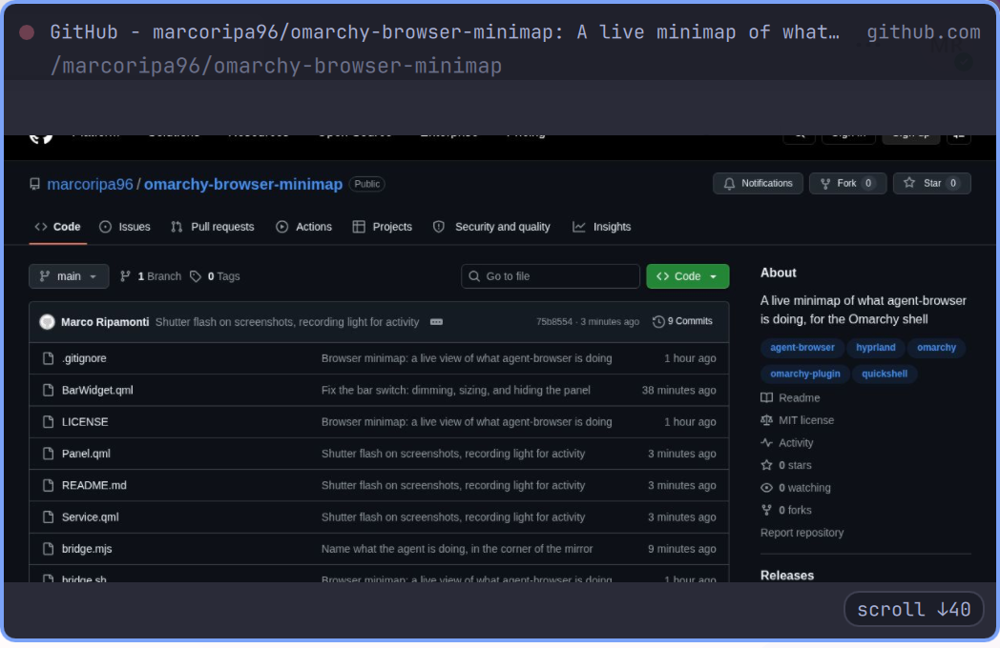

# Browser minimap

A live mirror of whatever `agent-browser` is looking at, pinned under the bar on
the focused output. It appears when a coding agent starts driving a browser and
steps aside when it stops.



## Installing

```bash
omarchy plugin add https://github.com/marcoripa96/omarchy-browser-minimap.git --enable
```

That enables the panel. To get the bar switch too, add the widget to a bar
section — `omarchy plugin enable io.github.marcoripa96.browser-minimap --section right`,
or drag it into place.

## How it works

`agent-browser` runs a WebSocket screencast server per session and advertises
the port in a file:

```
$XDG_RUNTIME_DIR/agent-browser/<session>.stream    ->  e.g. 39747
```

`bridge.mjs` watches that directory, connects to every session it finds, and
prints one JSON state line per change on stdout. `Service.qml` owns that process
and all the state derived from it; `Panel.qml` renders it and `BarWidget.qml`
switches it. Nothing polls the agent, and nothing needs the browser to be headed
— the stream works fine against a headless Chrome.

Frames arrive as base64 JPEG. The bridge writes them to
`$XDG_RUNTIME_DIR/omarchy-browser-minimap/frame-{a,b}.jpg` rather than piping
them through stdout, alternating the two names so the QML `Image` sees a URL
that actually changed. Two `Image` elements double-buffer the result: the back
one decodes off-screen and only becomes the front once it reports `Ready`. A
single `Image` with `cache: false` blanks itself between loads, which reads as a
flicker at any usable frame rate.

## Several sessions at once

Every connected session is tracked, but only one is mirrored at a time. With
more than one live, a rail appears down the left of the card listing them by
page title — what you actually recognise a session by, rather than the
`default`/`docs` names agent-browser uses internally. Each row carries a dot
that lights up while that session's page is painting, so you can see a
background agent working without switching to it.

Click a row to watch that session. Until you click, the minimap follows
whichever session painted most recently, which in practice means a page that
animates on its own wins over one that is merely being worked on — clicking is
how you say which one you actually care about. `auto` over IPC goes back to
following the busiest.

The rail is a fixed width (`railWidth`, default 132) and extra width rather
than a slice out of the mirror: the page keeps the size you asked for, the card
grows to hold the list, and a title too long for the rail is cut with an
ellipsis instead of wrapping or stretching the card.

## What the agent is doing

agent-browser broadcasts every command it runs to passive stream clients, so
the bridge can name each action without polling anything or issuing a single
command back into a session an agent is in the middle of driving. Actions
appear as a short stack in the bottom right of the mirror, newest at the
bottom, and fade after `actionTtlSec`.

Most of what an agent clicks is described in words, because its locator
commands carry the text they searched by:

```
click “More information”     find text "More information" click
click button “Accedi”        role=button[name="Accedi"]
type into “Search”           find label "Search" fill ...
click submit                 find testid submit click
click link                   find role link click
click #login-button          a bare CSS selector has nothing human in it
click element                a snapshot ref (@e1) means nothing to a reader
press Enter · scroll ↓120
```

The dot beside the page title is a recording light: red and slowly breathing
while the page is changing, dark and still when it is not. The session rail
carries the same light per session, without the breathing — three pulsing dots
in one small panel is noise, not information.

**Typed values are never shown.** `fill` and `type` carry the text being
entered, which is where passwords and tokens go, so the feed names the field
and stops there. Evaluated JavaScript is reported as `eval` for the same
reason.

Only raw pointer commands carry coordinates, and those get a ring drawn on the
page at the point. Selector-driven actions — nearly everything an agent does —
have no spatial information at all, which is why the feed names actions rather
than trying to draw a cursor.

A screenshot gets the shutter: the frames themselves look identical before and
after, so without it the one action that takes something away with it would
pass unmarked. `pdf` fires the same flash.

An action also counts as activity in its own right: a click that opens a menu
three frames later brings the panel up immediately rather than waiting for the
page to repaint.

## When it shows and when it goes away

There is no single clean "the agent is done" signal, so three rules cover it:

1. **The page stopped changing.** After `idleHideSec` (default 8) with a still
   viewport, the minimap fades out. This is the common case: CDP stops sending
   frames entirely for a static page, so a finished navigation goes quiet
   within a second.
2. **The page never stops changing.** Live consoles, spinners and ticking clocks
   repaint forever and would otherwise pin the minimap up permanently, so
   `maxVisibleSec` (default 45) caps a single stretch of visibility.
3. **Something happened.** A navigation, a session switch, or the first change
   after a quiet spell starts a new stretch and brings it back.

Right-click dismisses the current stretch by hand; rule 3 still returns it.
Closing the browser session hides it immediately.

The bridge hashes each frame payload and drops byte-identical ones, so a
screencast that keeps ticking over an unchanged page does not read as activity.

## Controls

| Where | Action | What it does |
|---|---|---|
| Bar icon | left | Turn the plugin on or off |
| Bar icon | middle | Cycle the shown session |
| Card | left | Toggle between `width` and `expandedWidth` |
| Card | right | Dismiss this stretch of visibility |
| Card | middle | Cycle the shown session |
| Rail row | left | Watch that session |

The bar glyph shows one thing only: white when the plugin is on, dimmed grey
when it is off. Whether a page is currently painting shows on the panel's own
dot and in the icon's tooltip, not in the bar colour — an icon that also turned
red while busy made the most active state look like the alarm state, and left
"off" and "on but idle" separated by nothing but opacity.

Switching the plugin off hides the minimap immediately, whether or not it was
on screen at the time.

Off is off: the bridge process exits, its WebSocket connections close, and
`agent-browser` stops encoding frames for a client that is no longer there. A
disabled plugin costs nothing but the bar glyph.

## IPC

Every control is scriptable, so it can go on a keybinding:

```bash
omarchy-shell io.github.marcoripa96.browser-minimap toggle     # on/off
omarchy-shell io.github.marcoripa96.browser-minimap cycle      # next session, then auto
omarchy-shell io.github.marcoripa96.browser-minimap select foo # pin a session by name
omarchy-shell io.github.marcoripa96.browser-minimap auto       # follow the busiest again
omarchy-shell io.github.marcoripa96.browser-minimap size       # toggle compact/expanded
omarchy-shell io.github.marcoripa96.browser-minimap expand
omarchy-shell io.github.marcoripa96.browser-minimap collapse
omarchy-shell io.github.marcoripa96.browser-minimap status     # JSON state
```

```conf
# hyprland.conf
bind = SUPER, B, exec, omarchy-shell io.github.marcoripa96.browser-minimap toggle
```

## Settings

With the widget on the bar, settings live in its bar-layout entry in
`~/.config/omarchy/shell.json`; otherwise they live in its `plugins[]` entry.
That is the same precedence the shell writes with, so a value is always read
back from where it was saved.

```json
{ "id": "io.github.marcoripa96.browser-minimap", "width": 420, "idleHideSec": 12 }
```

| Key             | Default | What it does                                                        |
|-----------------|---------|---------------------------------------------------------------------|
| `enabled`       | true    | The bar icon writes this; false stops the bridge entirely            |
| `fps`           | 4       | Frame rate cap, applied server-side by agent-browser                 |
| `width`         | 360     | Compact width; height follows the browser viewport's aspect ratio    |
| `expandedWidth` | 720     | Width after a left-click                                             |
| `topMargin`     | 12      | Gap below the bar                                                    |
| `rightMargin`   | 12      | Gap from the screen edge                                             |
| `showCaption`   | true    | Page title and URL above the image                                   |
| `clickThrough`  | false   | Purely ambient: never takes pointer input, cannot be clicked         |
| `monitor`       | ""      | Output name to pin to (e.g. `HDMI-A-1`); empty follows focus         |
| `idleHideSec`   | 8       | Hide after this long without a visual change; 0 disables rule 1      |
| `maxVisibleSec` | 45      | Cap on one stretch of visibility; 0 disables rule 2                  |
| `railWidth`     | 132     | Width of the session rail, added to the card rather than the mirror  |
| `showActions`   | true    | Name each action the agent performs, in the bottom right             |
| `actionTtlSec`  | 4       | How long an action stays on screen                                   |
| `maxActions`    | 4       | How many actions are stacked at once                                 |
| `session`       | ""      | Hard pin: the bridge only ever connects to this session              |
| `debug`         | false   | Log show/hide reasoning to the `omarchy-shell` journal tag           |

`session` and the rail are different things. `session` is durable and narrows
what the bridge watches at all; the rail is a runtime choice among the sessions
it is already watching, and is deliberately not persisted — a session name from
an hour ago means nothing after a restart.

Changes to `fps` and `session` restart the bridge; the rest apply live.

## Why the window is bigger than the card

The layer-shell surface is sized to the largest the card can get and left
there; the card is anchored in its top-right corner and animates inside it,
with the input region masked to the card so the transparent margin passes
clicks through.

Binding the surface to the animating card instead — the obvious way round —
resizes the Wayland surface on every animation frame, and Hyprland animates
layer resizes itself (`layersIn`/`layersOut`). Every frame of the QML
animation therefore kicked off a compositor animation of its own, and the two
fought over the same rectangle. Expanding the card now changes the surface
geometry not at all, and the motion runs entirely on the scene graph.

## Cost

At the default 4fps a 1440x900 viewport is roughly 150KB per changed frame,
written to tmpfs and decoded once. Only the shown session's frames are written;
the rest are tracked for their activity dot and kept in memory in case you
switch to them. Raising `fps` raises both linearly, and the decode happens
inside `omarchy-shell` — worth remembering before setting it to 30.

## Requirements

- `agent-browser` on the box (any session, headless or headed)
- a `node` runtime; `bridge.sh` probes the mise shim, `$PATH`, and `/usr/bin`

## Developing

This repo *is* the installed plugin: it lives at
`~/.config/omarchy/plugins/io.github.marcoripa96.browser-minimap`, so edits are
live and `git push` publishes them. `omarchy plugin update <id>` fast-forwards
the same checkout on other machines.

```bash
omarchy plugin validate .                              # manifest contract
qmllint -I "$OMARCHY_PATH/shell" Service.qml Panel.qml BarWidget.qml
omarchy restart shell                                  # reload; NOT `refresh shell`,
                                                       # which resets shell.json to defaults
journalctl --user -t omarchy-shell -f                  # the shell's log
```

Run the bridge on its own to see exactly what the shell sees:

```bash
./bridge.sh ./bridge.mjs --fps 4
```
