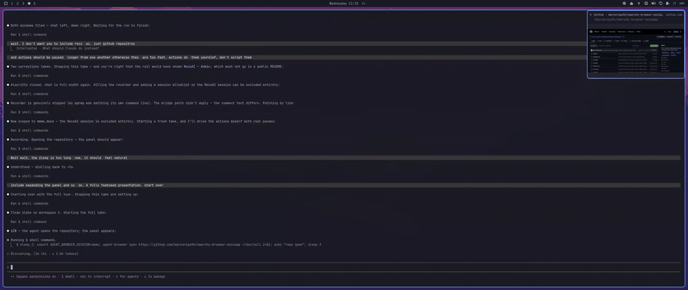
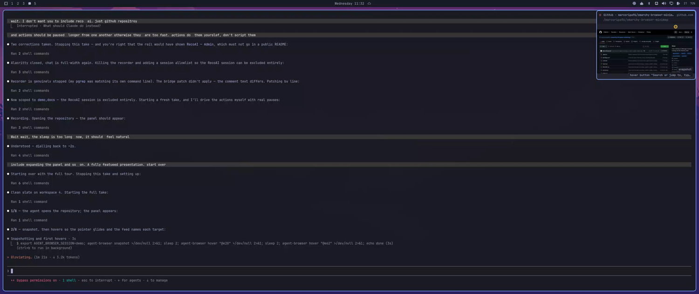
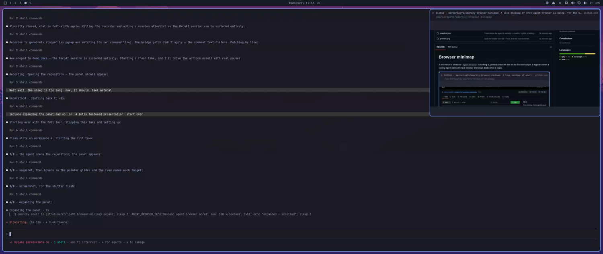
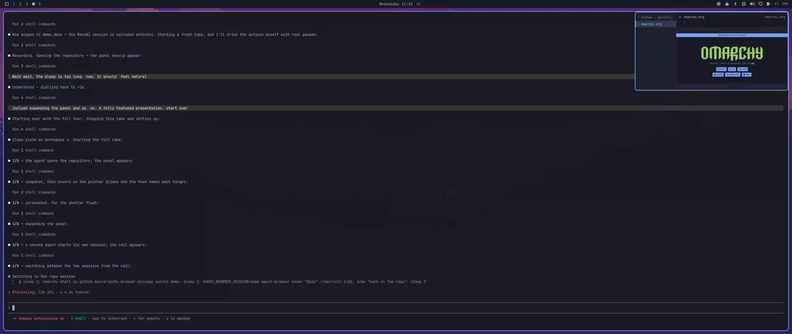
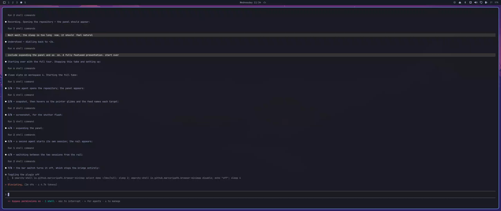

# Browser minimap

A live mirror of whatever `agent-browser` is looking at, pinned under the bar on
the focused output. It appears when a coding agent starts driving a browser and
steps aside when it stops.



*An agent opens this repository, snapshots it, moves over a few elements, takes
a screenshot, and the panel expands — all watched from the corner of the
desktop.*

## What you are looking at



The panel sits under the bar on the focused output. The recording light beside
the title is lit while the page is painting, the yellow marker is where the
agent just acted, and the stack in the corner names the last few actions.



Left-click to expand it — here it is mirroring this repository's own README.



When more than one agent-browser session is live, a rail lists them by page
title. Click one to watch it.



The globe in the bar turns the whole thing off: the panel goes, the bridge
process exits, and nothing is left running but that icon.

---


The header splits the page across two lines: its title with the host beside it,
and the route on its own underneath. One long URL buries both the "which site"
and the "where in it", and those are the two questions you actually ask of a
minimap. The route elides from the left so the tail — the id an agent just
navigated to — survives.

## Installing

```bash
omarchy plugin add https://github.com/marcoripa96/omarchy-browser-minimap.git --enable
```

That is the whole install: the panel starts watching, and the switch lands in
the right-hand side of the bar. Pass `--section left|center` to put it
somewhere else, or drag it once it is there.

## How it works

`agent-browser` runs a WebSocket screencast server per session and advertises
the port in a file:

```
$XDG_RUNTIME_DIR/agent-browser/<session>.stream    ->  e.g. 39747
```

The bridge — a small Rust daemon, source in `bridge/` — watches that directory,
connects to every session it finds, and prints one JSON state line per change
on stdout. `Service.qml` owns that process and all the state derived from it;
`Panel.qml` renders it and `BarWidget.qml` switches it. Nothing polls the
agent, and nothing needs the browser to be headed — the stream works fine
against a headless Chrome.

Frames arrive as base64 JPEG. The bridge writes them to
`$XDG_RUNTIME_DIR/omarchy-browser-minimap/frame-{a,b}.jpg` rather than piping
them through stdout, alternating the two names so the QML `Image` sees a URL
that actually changed. Two `Image` elements double-buffer the result: the back
one decodes off-screen and only becomes the front once it reports `Ready`. A
single `Image` with `cache: false` blanks itself between loads, which reads as a
flicker at any usable frame rate.

## Several sessions at once

Every connected session is tracked, but only one is mirrored at a time. With
more than one live, a rail appears down the left of the card listing them by
page title — what you actually recognise a session by, rather than the
`default`/`docs` names agent-browser uses internally. Each row carries a dot
that lights up while that session's page is painting, so you can see a
background agent working without switching to it.

Click a row to watch that session. Until you click, the minimap follows
whichever session painted most recently, which in practice means a page that
animates on its own wins over one that is merely being worked on — clicking is
how you say which one you actually care about. `auto` over IPC goes back to
following the busiest.

The rail is a fixed width (`railWidth`, default 132) and extra width rather
than a slice out of the mirror: the page keeps the size you asked for, the card
grows to hold the list, and a title too long for the rail is cut with an
ellipsis instead of wrapping or stretching the card.

## What the agent is doing

agent-browser broadcasts every command it runs to passive stream clients, so
the bridge can name each action without polling anything or issuing a single
command back into a session an agent is in the middle of driving. Actions
appear as a short stack in the bottom right of the mirror, newest at the
bottom, and fade after `actionTtlSec`.

Most of what an agent clicks is described in words, because its locator
commands carry the text they searched by:

```
click “More information”     find text "More information" click
click button “Accedi”        role=button[name="Accedi"]
type into “Search”           find label "Search" fill ...
click submit                 find testid submit click
click link                   find role link click
click #login-button          a bare CSS selector has nothing human in it
hover link “The ISO”         a snapshot ref, named from the snapshot's ref table
click element                a ref from before the bridge saw any snapshot
press Enter · scroll ↓120
```

The dot beside the page title is a recording light: red and slowly breathing
while the page is changing, dark and still when it is not. The session rail
carries the same light per session, without the breathing — three pulsing dots
in one small panel is noise, not information.

**Typed values are never shown.** `fill` and `type` carry the text being
entered, which is where passwords and tokens go, so the feed names the field
and stops there. Evaluated JavaScript is reported as `eval` for the same
reason.

## Where the agent is working

A marker glides to each place the agent acts, leaving a trail that fades behind
it. The endpoints are real; the movement between them is not. agent-browser
reports *what* an action targeted, never a path taken to it — there is no
cursor to observe, because synthetic input has no travel. So the marker is told
where to be next and animates there, which is the honest way to show a sequence
of positions.

Positions come from three places, in descending order of directness:

- raw `mouse move` and `mousedown` carry `x`/`y` outright;
- a snapshot ref (`@e5`) or a plain CSS selector is resolved to its box with one
  read-only `get box` query;
- Playwright's `text=` and `role=` engines, and the `getby*` locator commands,
  cannot be resolved at all — those actions are named in the feed but not drawn.

Refs are the common case, since agents work by taking a snapshot and clicking
what it returned, and the daemon keeps a session's refs so a separate query can
resolve them.

The marker does not follow the theme accent. It sits on top of arbitrary web
pages rather than on the shell's own surfaces, so it wants a colour that stays
legible over a white page and a dark one alike and that a site is unlikely to
be using for its own chrome.

**This is the one feature that issues commands into a session an agent is
driving.** They are read-only box queries, one per action, at most one in
flight per session, and they are filtered back out of the feed so the plugin
never reports its own plumbing as agent activity. Set `showPointer` to false
and the bridge goes back to issuing nothing at all.

A screenshot gets the shutter: the frames themselves look identical before and
after, so without it the one action that takes something away with it would
pass unmarked. `pdf` fires the same flash.

An action also counts as activity in its own right: a click that opens a menu
three frames later brings the panel up immediately rather than waiting for the
page to repaint.

## When it shows and when it goes away

There is no single clean "the agent is done" signal, so three rules cover it:

1. **The page stopped changing.** After `idleHideSec` (default 8) with a still
   viewport, the minimap fades out. This is the common case: CDP stops sending
   frames entirely for a static page, so a finished navigation goes quiet
   within a second.
2. **The page never stops changing.** Live consoles, spinners and ticking clocks
   repaint forever and would otherwise pin the minimap up permanently, so
   `maxVisibleSec` (default 45) caps a single stretch of visibility.
3. **Something happened.** A navigation, a session switch, or the first change
   after a quiet spell starts a new stretch and brings it back.

Right-click dismisses the current stretch by hand; rule 3 still returns it.
Closing the browser session hides it immediately.

The bridge hashes each frame payload and drops byte-identical ones, so a
screencast that keeps ticking over an unchanged page does not read as activity.

## Controls

| Where | Action | What it does |
|---|---|---|
| Bar icon | left | Turn the plugin on or off |
| Bar icon | middle | Cycle the shown session |
| Card | drag | Move it; on release it settles into the nearest corner |
| Card | left | Toggle between `width` and `expandedWidth` |
| Card | right | Dismiss this stretch of visibility |
| Card | middle | Cycle the shown session |
| Rail row | left | Watch that session |

The bar glyph shows one thing only: white when the plugin is on, dimmed grey
when it is off. Whether a page is currently painting shows on the panel's own
dot and in the icon's tooltip, not in the bar colour — an icon that also turned
red while busy made the most active state look like the alarm state, and left
"off" and "on but idle" separated by nothing but opacity.

Switching the plugin off hides the minimap immediately, whether or not it was
on screen at the time.

Off is off: the bridge process exits, its WebSocket connections close, and
`agent-browser` stops encoding frames for a client that is no longer there. A
disabled plugin costs nothing but the bar glyph.

## IPC

Every control is scriptable, so it can go on a keybinding:

```bash
omarchy-shell io.github.marcoripa96.browser-minimap toggle     # on/off
omarchy-shell io.github.marcoripa96.browser-minimap cycle      # next session, then auto
omarchy-shell io.github.marcoripa96.browser-minimap select foo # pin a session by name
omarchy-shell io.github.marcoripa96.browser-minimap auto       # follow the busiest again
omarchy-shell io.github.marcoripa96.browser-minimap size       # toggle compact/expanded
omarchy-shell io.github.marcoripa96.browser-minimap expand
omarchy-shell io.github.marcoripa96.browser-minimap collapse
omarchy-shell io.github.marcoripa96.browser-minimap status     # JSON state
```

```conf
# hyprland.conf
bind = SUPER, B, exec, omarchy-shell io.github.marcoripa96.browser-minimap toggle
```

## Settings

With the widget on the bar, settings live in its bar-layout entry in
`~/.config/omarchy/shell.json`; otherwise they live in its `plugins[]` entry.
That is the same precedence the shell writes with, so a value is always read
back from where it was saved.

```json
{ "id": "io.github.marcoripa96.browser-minimap", "width": 420, "idleHideSec": 12 }
```

| Key             | Default | What it does                                                        |
|-----------------|---------|---------------------------------------------------------------------|
| `enabled`       | true    | The bar icon writes this; false stops the bridge entirely            |
| `fps`           | 4       | Frame rate cap, applied server-side by agent-browser                 |
| `width`         | 360     | Compact width; height follows the browser viewport's aspect ratio    |
| `expandedWidth` | 720     | Width after a left-click                                             |
| `topMargin`     | 12      | Gap below the bar                                                    |
| `rightMargin`   | 12      | Gap from the screen edge                                             |
| `showCaption`   | true    | Page title and URL above the image                                   |
| `clickThrough`  | false   | Purely ambient: never takes pointer input, cannot be clicked         |
| `corner`        | top-right | Which corner it rests in; set by dragging and dropping it          |
| `margin`        | 12      | Gap from the two edges of that corner                                |
| `monitor`       | ""      | Output name to pin to (e.g. `HDMI-A-1`); empty follows focus         |
| `idleHideSec`   | 8       | Hide after this long without a visual change; 0 disables rule 1      |
| `maxVisibleSec` | 45      | Cap on one stretch of visibility; 0 disables rule 2                  |
| `railWidth`     | 132     | Width of the session rail, added to the card rather than the mirror  |
| `showActions`   | true    | Name each action the agent performs, in the bottom right             |
| `actionTtlSec`  | 4       | How long an action stays on screen                                   |
| `maxActions`    | 4       | How many actions are stacked at once                                 |
| `showPointer`   | true    | Marker and trail where the agent acts; off stops all box queries      |
| `pointerTrailMs`| 700     | How long the trail takes to fade                                     |
| `pointerGlideMs`| 380     | How long the marker takes to travel between two points               |
| `pointerColor`  | #ffc83d | Any QML colour; amber by default rather than the theme accent         |
| `session`       | ""      | Session names to watch, comma separated; empty watches all of them   |
| `debug`         | false   | Log show/hide reasoning to the `omarchy-shell` journal tag           |

`session` and the rail are different things. `session` is durable, takes a
comma-separated list, and narrows what the bridge connects to at all — which is
also how you keep a session you would rather not have mirrored off the screen
entirely; the rail is a runtime choice among the sessions
it is already watching, and is deliberately not persisted — a session name from
an hour ago means nothing after a restart.

Changes to `fps`, `session` and `showPointer` restart the bridge; the rest
apply live.

## Why the window covers the whole output

The layer-shell surface spans the output and the card is positioned inside it,
with the input region masked to the card so everywhere else passes clicks
straight through to whatever is underneath. That is what lets the card be
dragged anywhere and settle into any corner, and it means the surface never
changes size.

Sizing the surface to the card instead — the obvious way round — resizes the
Wayland surface on every animation frame, and Hyprland animates layer resizes
itself (`layersIn`/`layersOut`). Every frame of the QML animation therefore
kicked off a compositor animation of its own, and the two fought over the same
rectangle. Expanding, dragging and snapping now change the surface geometry not
at all; the motion runs entirely on the scene graph.

Because a layer surface belongs to one output, dragging moves the card within
the current screen. Use `monitor` to pin it to a different one.

## Cost

At the default 4fps a 1440x900 viewport is roughly 150KB per changed frame,
written to tmpfs and decoded once. Only the shown session's frames are written;
the rest are tracked for their activity dot and kept in memory in case you
switch to them — and their streams drop to 1fps once they have been out of the
spotlight for ten seconds, since an idle stream still costs its browser a JPEG
encode per frame. A hidden card decodes nothing: frames that arrive while it
is dismissed are counted for the show/hide rules but never touched. Raising
`fps` raises everything linearly, and the decode happens inside
`omarchy-shell` — worth remembering before setting it to 30.

## Requirements

- `agent-browser` on the box (any session, headless or headed)

The bridge itself is a static binary with no runtime dependencies. `bridge.sh`
fetches the one matching `uname -m` (x86_64 or aarch64) from this repository's
releases the first time the plugin starts, caches it under
`~/.cache/omarchy-browser-minimap/` keyed to the plugin version, and execs it —
so the only tool it needs is `curl`, and only for that first run. On any other
architecture, build it yourself: `cargo build --release` in `bridge/` produces
a binary `bridge.sh` prefers over the download.

## Developing

Keep the working copy somewhere of your own and let the install stay a plain
clone of this repository, so what you test is what a user receives:

```bash
git clone https://github.com/marcoripa96/omarchy-browser-minimap.git ~/git/omarchy-browser-minimap
omarchy plugin add https://github.com/marcoripa96/omarchy-browser-minimap.git

# then, per change:
git -C ~/git/omarchy-browser-minimap push
omarchy plugin update io.github.marcoripa96.browser-minimap
omarchy restart shell
```

Editing the installed copy directly is quicker, but it hides the difference
between your working tree and a fresh checkout — file modes are the usual
casualty, and `bridge.sh` losing its executable bit would break every install
while working perfectly on the machine it was written on.

```bash
omarchy plugin validate .                              # manifest contract
qmllint -I "$OMARCHY_PATH/shell" Service.qml Panel.qml BarWidget.qml
omarchy restart shell                                  # reload; NOT `refresh shell`,
                                                       # which resets shell.json to defaults
journalctl --user -t omarchy-shell -f                  # the shell's log
```

Run the bridge on its own to see exactly what the shell sees:

```bash
./bridge.sh --fps 4
```

`bridge.sh` prefers a dev build at `bridge/target/release/` over the
downloaded release binary, so a working copy tests its own code:

```bash
cargo build --release --manifest-path bridge/Cargo.toml
cargo test --manifest-path bridge/Cargo.toml
cargo clippy --all-targets --locked --manifest-path bridge/Cargo.toml -- -D warnings
```

The release workflow runs the tests, clippy and `cargo fmt --check` before it
builds anything, so a tag with a lint failure never becomes a release.

`OMARCHY_BROWSER_MINIMAP_BRIDGE` overrides the binary path outright — useful
for pointing an installed plugin at a build in your working copy. Releasing is
pushing a tag `v<version>` matching `manifest.json`: the release workflow
builds static binaries for both architectures and attaches them where
`bridge.sh` expects to find them.
